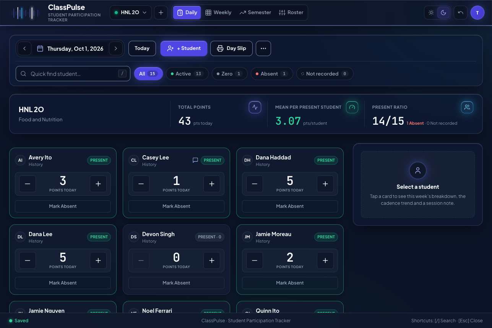
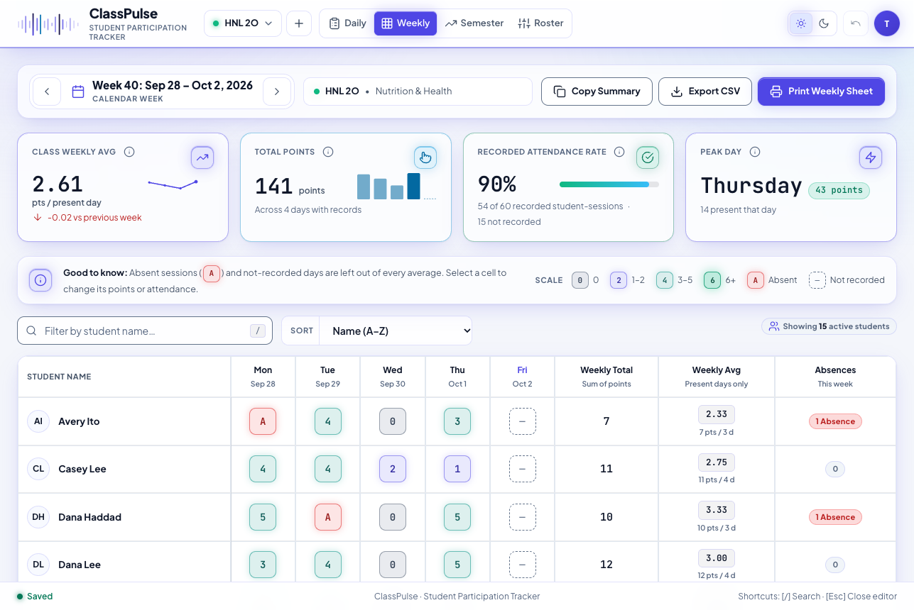
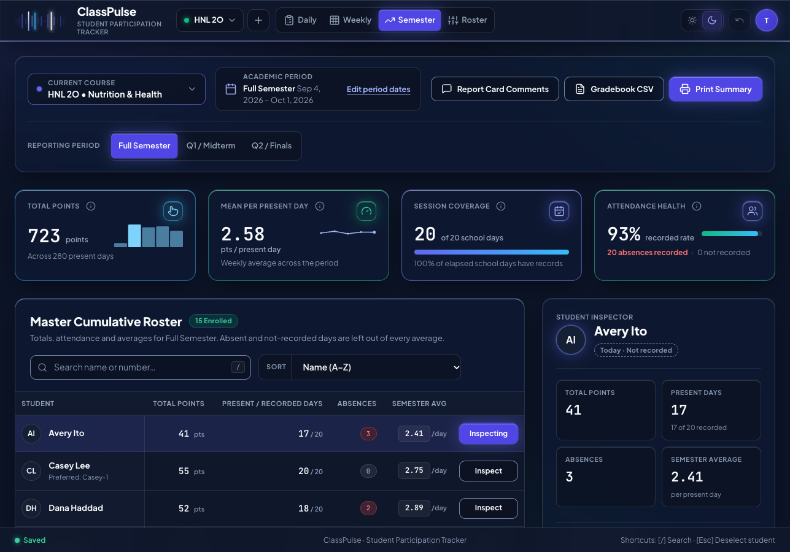
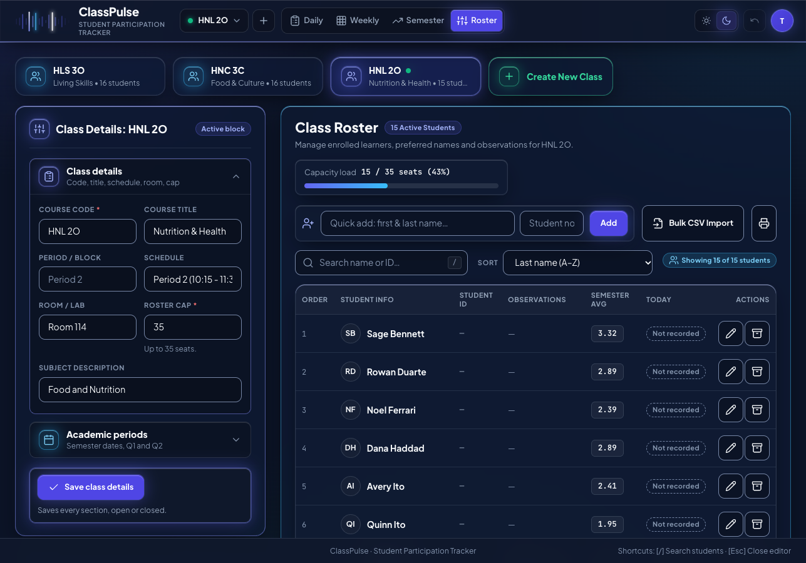

# ClassPulse

ClassPulse is a web application for tracking student participation and attendance, reviewing weekly and semester results, and managing class rosters.

Participation is recorded per student per school day (Monday to Friday, America/Toronto time zone) by tapping cards. The
application also prepares report-card comment drafts and imports or exports class lists as CSV. It is a server-rendered
Laravel + Blade application on MariaDB with hand-written CSS and JavaScript (no build step), developed and verified locally
with Docker and packaged for shared PHP hosting.

**Deployment status.** The original application is deployed on Hostinger and is actively used by a teacher. This independent portfolio copy was verified locally and contains only fictitious demonstration data.

> This repository is shown for portfolio and review purposes. It is **not open source**: all rights reserved, see
> [License](#license). All data in the screenshots and seeds is fictitious.

| Daily Tracker (dark) | Weekly Matrix (light) |
|---|---|
|  |  |

| Semester Analytics with student inspector | Class Roster & Settings |
|---|---|
|  |  |

More captures are in [`docs/screenshots/`](docs/screenshots/): login, Daily light theme, Daily student panel, Weekly dark,
Semester, Roster light theme, and mobile (375 px) Daily and Weekly.

## Contents

- [What ClassPulse does](#what-classpulse-does)
- [Tech stack and verified versions](#tech-stack-and-verified-versions)
- [Architecture](#architecture)
- [Project structure](#project-structure)
- [Getting started (local, Docker only)](#getting-started-local-docker-only)
- [Running the tests](#running-the-tests)
- [Deployment (Hostinger packaging)](#deployment-hostinger-packaging)
- [Current limitations](#current-limitations)
- [My role and how this was built](#my-role-and-how-this-was-built)
- [License](#license)

## What ClassPulse does

Only features that exist in the code and are covered by tests or documented checks are listed.

**Daily Tracker**
- One card per student with three states: **Not recorded**, **Recorded zero** (present, 0 points) and **Absent**;
  state is always shown as text as well as colour.
- `+` / `-` points per student (minimum 0), filters (All / Active / Zero / Absent / Not recorded) and quick search.
- Autosave through a client save queue (one operation in flight) with an idempotent `op_id` per operation: a replayed
  operation changes nothing. Undo is available from the header.
- Add a student from the toolbar, per-student side panel (week breakdown, cadence trend, dated note), and a printable
  **Day Slip**.

**Weekly Matrix**
- Student-by-weekday matrix with KPI cards and sparklines, search and sort, a quick cell editor (set points or
  attendance), **Copy Summary**, CSV export and a print layout.

**Semester Analytics**
- Configurable Q1/Q2 reporting periods (plus full semester), KPIs, master roster table, student inspector (weekly
  evolution, audit log, dated notes), **Report Card Comments** drafts persisted per student, class and period (generated
  from a template, no AI), CSV export and a print layout.
- Absent and not-recorded days are left out of every average; a student with zero present days shows `No data`.

**Class Roster & Settings**
- Multiple classes, a limit of 35 active students per class (archived students do not count), preferred names and
  observations, archive/restore, CSV or pasted import with a preview and capacity checks, locked calculation rules,
  and a **Files & backups** section that states plainly that CSV reports are not backups.
- **Account**: change email and password (current password required; a new password signs out every session).

**Cross-cutting**
- Session authentication with login throttling and an optional "Remember my email" (stores only the address in the
  browser, never the password); security headers and a strict Content Security Policy (no inline scripts or styles).
- Light and dark themes, responsive shells (desktop and phone), self-hosted fonts, a custom SVG icon family and logo.
- Accessibility work: a keyboard-audit tool (real key events in headless Chrome), focus-visible tests, colour-contrast
  unit tests.
- Print layouts for Daily, Weekly, Semester and Roster, verified as PDFs generated from Chrome.
- Release packaging scripts for shared hosting (Hostinger layout) and an update kit, each with a verification script.

## Tech stack and verified versions

| Component | Version | Source in this repo |
|---|---|---|
| Laravel framework | v13.34.0 | `composer.lock` |
| PHP | 8.3 (`php:8.3-cli-bookworm`; `composer.json` requires `^8.3`) | `Dockerfile`, `composer.json` |
| Composer | 2.10.3 | `Dockerfile` |
| MariaDB | 10.11 (`mariadb:10.11`) | `docker-compose.yml` |
| PHPUnit | 12.5.37 | `composer.lock` |
| Laravel Pint | v1.32.1 (preset `laravel`) | `composer.lock`, `pint.json` |
| Node (JS unit tests and syntax checks only) | `node:24-alpine`, `node --test`, zero packages | `docker-compose.yml` |
| Front end | Blade, hand-written CSS/JS, no bundler, no CDN, no remote fonts | `public/`, `resources/views/` |
| Fonts | Plus Jakarta Sans, JetBrains Mono (self-hosted, SIL OFL 1.1) | `public/fonts/` |

For local development, Docker contains all the dependencies: PHP, Composer, MariaDB and the Node test image are **not** needed
on the host. The Hostinger deployment does not use Docker: it runs on the hosting provider's own PHP and MariaDB, with the
`vendor/` folder built beforehand and shipped inside the release package.

## Architecture

Write path (a tap on a card):

```
public/js/daily.js -> public/js/save-queue.js (one op in flight, UUID op_id)
  -> POST /api/classes/{class}/days/{date}/operations        (routes/web.php)
  -> app/Http/Requests/DayOperationRequest.php               (validation)
  -> app/Http/Controllers/Api/DayController.php              (thin)
  -> app/Services/ParticipationService.php                   (transaction, class row lock, events for undo)
  -> app/Models/* -> MariaDB
```

The response carries the full day state and the browser re-renders from it. Read path: controller ->
`app/Support/ParticipationStats.php` (pure PHP over plain arrays) -> Blade view; CSV through `app/Support/CsvWriter.php`.

| Layer | May use | Must not |
|---|---|---|
| `app/Http/Controllers/**` | Requests, Services, Support, Models (reads) | write entries, operations or events |
| `app/Services/ParticipationService.php` | Models, `SchoolCalendar`, DB transactions | read the HTTP request |
| `app/Support/**` | plain PHP, Carbon | touch the database or the request |
| `resources/views/**` | `{{ }}`, Blade components | `{!! !!}`, inline `<script>`/`<style>`/`style=""` |
| `public/js/**` | DOM, `fetch` | `import`/`export`, compute stored totals, keep data in `localStorage` (two documented exceptions: theme, remembered email) |

Key rules: every student/entry query is scoped by `school_class_id`; integers are stored and averages are rounded only
for display; one JSON shape for success (`{"data": ...}`) and errors (`{"error": {"code", "message"}}`). The full
architecture, design tokens and path-scoped rules are in [`CLAUDE.md`](CLAUDE.md) and [`.claude/rules/`](.claude/rules/).

## Project structure

```
app/                Console commands, controllers, form requests, middleware, models, services, support classes
bootstrap/ config/  Laravel bootstrap and configuration (config/classpulse.php holds the product limits)
database/           Migrations and factories (schema changes are always new migrations)
public/             index.php, hand-written css/ and js/, brand/ (logo), fonts/ (self-hosted)
resources/views/    Blade views and components (daily, weekly, semester, roster, login, print)
routes/             web.php, console.php
scripts/            setup-local.sh, release packaging and verification, dev tools (scripts/dev), logo builder
tests/              PHPUnit (Feature, Unit) and node:test JavaScript tests (tests/js)
docs/               Owner and development documentation (mostly Spanish), screenshots, design notes
blueprints/         Historical build plan the project was generated from (kept for transparency)
.claude/            Rules and skills given to the AI coding agent (kept for transparency)
```

## Getting started (local, Docker only)

**Prerequisites:** Docker Desktop (or Docker Engine) with Compose v2, and git. Nothing else: Docker provides PHP, Composer and MariaDB for local development only.

### Quick start

```bash
git clone https://github.com/intellibrandai/classpulse.git classpulse
cd classpulse
./scripts/setup-local.sh --demo
```

The script is idempotent and runs the same steps as the manual flow below. With `--demo` it also loads fictitious data and
prints a demo password **once**; copy it from the terminal. Then open http://localhost:8090 and sign in as
`teacher@classpulse.test`.

### Manual steps

```bash
git clone https://github.com/intellibrandai/classpulse.git classpulse
cd classpulse
cp .env.example .env
docker compose up -d --build
docker compose exec -T app composer install
docker compose exec -T app php artisan key:generate
docker compose exec -T db mariadb -uroot -pclasspulse_local_root -e "CREATE DATABASE IF NOT EXISTS classpulse_test; GRANT ALL ON classpulse_test.* TO 'classpulse'@'%'; FLUSH PRIVILEGES;"
docker compose exec -T app php artisan migrate --force
docker compose exec -T app php artisan classpulse:demo-seed --days=20 --periods
```

Open http://localhost:8090. Check health with `curl -s -o /dev/null -w '%{http_code}' http://localhost:8090/up` (prints `200`).

### Database configuration

- The `db` service (`mariadb:10.11`) creates the `classpulse` database and user from `docker-compose.yml`. The credentials
  in `.env.example` and `docker-compose.yml` are throwaway local defaults for a database that is only published on
  `127.0.0.1`; production credentials are never kept in this repository.
- Variables: `DB_CONNECTION`, `DB_HOST`, `DB_PORT`, `DB_DATABASE`, `DB_USERNAME`, `DB_PASSWORD` in `.env`.
- PHPUnit uses a separate database, `classpulse_test`, configured in `phpunit.xml` (never `.env`). The "create the test
  database" command above is what makes it exist. Never point tests at the dev database.

### Demo data and a local test account

- `docker compose exec -T app php artisan classpulse:demo-seed [--days=20] [--periods]` creates three fictitious classes
  with invented students and participation for the previous school days (`--periods` also configures Q1/Q2) and the
  account `teacher@classpulse.test` with a random password printed **once**. It only runs with `APP_ENV=local` and on a
  database without classes; with `APP_ENV=production` it refuses and exits with an error.
- Alternatively create your own account on an empty database (interactive; it asks for the password twice, so no `-T`):
  `docker compose exec app php artisan classpulse:create-teacher you@example.test`. The app is built around a single
  teacher account: the command refuses if one already exists. There is no non-interactive mode.
- Lost password: `php artisan classpulse:reset-password <email>` (see `docs/access-and-recovery.md`, in Spanish).

### Changing ports

The web and database host ports come from `.env` (read by Docker Compose only): set `CLASSPULSE_WEB_PORT` and
`CLASSPULSE_DB_PORT`, update `APP_URL`, then `docker compose up -d`. To run a second copy next to another Compose project,
also set `COMPOSE_PROJECT_NAME` (for example `export COMPOSE_PROJECT_NAME=classpulse-demo`). The dev tools read the base URL
from `CLASSPULSE_URL`.

Stop without losing data: `docker compose stop`. `docker compose down -v` deletes the database volume.

## Running the tests

```bash
docker compose exec -T app vendor/bin/pint --test        # code style (preset: laravel)
docker compose exec -T app vendor/bin/phpunit            # PHP tests
docker compose --profile test run --rm jstest            # JavaScript unit tests (node --test)
```

Last full run (fresh clone, see below): PHPUnit 12.5.37: 463 tests, 3757 assertions, all passing; JavaScript: 114 tests, 0 failures; Pint passes. The "gate" used during development
also greps the JS pass count, because a run with no test files still exits 0:

```bash
docker compose exec -T app vendor/bin/pint --test
docker compose exec -T app vendor/bin/phpunit
docker compose --profile test run --rm jstest > /tmp/classpulse-jstest.txt && grep -qE '(ℹ|#) pass [1-9]' /tmp/classpulse-jstest.txt && grep -qE '(ℹ|#) fail 0' /tmp/classpulse-jstest.txt
```

**Optional dev tools** (`scripts/dev/`, Node built-ins only, they drive headless Google Chrome through the DevTools
protocol; written on macOS, with the Chrome path hard-coded in `scripts/dev/lib/cdp.mjs`): keyboard audit, header-width
sweep, print-to-PDF with edge checks, full-panel captures. They log in with the password stored in the git-ignored
`storage/app/local-test-login.txt` (a line `Password: <value>`). See [`docs/dev-tools.md`](docs/dev-tools.md),
[`docs/keyboard-audit.md`](docs/keyboard-audit.md) and [`docs/header-sweep.md`](docs/header-sweep.md). They are not part of
the test gate.

## Deployment (Hostinger packaging)

The original application runs on Hostinger shared PHP hosting, with the application folder beside `public_html`, using the
hosting's own PHP and MariaDB (no Docker there). Nothing is deployed from this repository automatically; the owner
publishes by hand. The production site, its database and its configuration are not part of this repository.

**What was verified where.** The automated checks described in this README (tests, the fresh-clone run and the release
verification) were run locally, against fictitious data. They do not cover the live site: that is known only from its
production use by a teacher, not from tests in this repository.

```bash
./scripts/package-release.sh && ./scripts/verify-release.sh      # builds dist/ and checks it
```

This produces zips for the app and `public_html`, an `install.sql`, checksums and a Spanish install guide in `dist/`
(git-ignored), and the verifier checks that the package contains no secrets, test data or development files. An
update kit for an already-installed site (`package-update.sh`, `verify-update.sh`) exists too. The guides are in
[`docs/`](docs/) and are written in **Spanish** for the owner: [`hostinger-deploy.md`](docs/hostinger-deploy.md),
[`hostinger-update.md`](docs/hostinger-update.md), [`hosting-requirements.md`](docs/hosting-requirements.md) (English),
[`backups.md`](docs/backups.md), [`access-and-recovery.md`](docs/access-and-recovery.md). The original Spanish README is
[`docs/es/README.es.md`](docs/es/README.es.md). Items that depend on a real hosting plan are marked "to verify" there:
the packages and guides were verified locally by the scripts above, and hosting-specific details are marked "to verify" because the scripts cannot check them on a live host.

## Current limitations

- No Google integration and no AI features inside the application; the report-comment drafts come from a text template.
- No multi-teacher data isolation: the app is designed for one teacher account, and any account would share the same classes.
  The Account screen only manages the signed-in user's own credentials. No public sign-up and no email-based password
  recovery (recovery is a command or a documented database procedure).
- No complete, restorable backup feature in the app. CSV exports are reports, not backups; use hosting or database backups.
- Only Chrome-family behaviour was verified in a real browser (headless Chrome). Safari, Firefox, iOS and Android were
  not tested; see [`docs/browser-compatibility.md`](docs/browser-compatibility.md) for the static analysis only.
- Print layouts were verified as PDFs from Chrome only, not on a physical printer.
- English user interface only. The verification in this repository did not include 100+ students, a screen reader or a real touch device.
- Local development is Docker-only. The checks in this repository were run locally and do not cover the live Hostinger site, which is not part of the repository.

## My role and how this was built

I defined the product: a digital participation clipboard for a teacher, with its features and rules, such as a minimum of
zero points and excluding absent and not-recorded days from averages. I drove the visual design: I used Google Stitch to
produce the design reference, approved the screens, the logo and the final finish, and iterated with feedback on layout,
responsiveness and accessibility. I directed the AI-assisted development, decided the scope, tested the application by hand
and reported defects, and handled the deployment to Hostinger shared hosting (the release package, update kit and instructions are in this repository).

Most of the code was written by AI coding agents under my direction. Claude Code (Anthropic) was the main coding agent: it
planned the build from a validated blueprint (kept in `blueprints/`), implemented the tasks, wrote the tests, ran the
verification tools and produced the release packages, in sessions I supervised. The history of the original private
project carried commits co-authored by Claude where indicated; the history of this repository starts fresh with a single
commit. OpenAI Codex supported requirements clarification, review of screenshots and implementation reports, preparation of instructions for Claude Code, deployment guidance, and user documentation.

The AI-generated code was verified by automated tests and tooling plus my manual testing. I do not claim to have reviewed
every line by hand. No AI or LLM is used by the application at runtime.

## License

All rights reserved, see [LICENSE.md](LICENSE.md). No license for reuse is granted. Third-party components keep their own
licenses ([THIRD_PARTY_NOTICES.md](THIRD_PARTY_NOTICES.md)).

Contact: through the GitHub profile of the repository owner.
